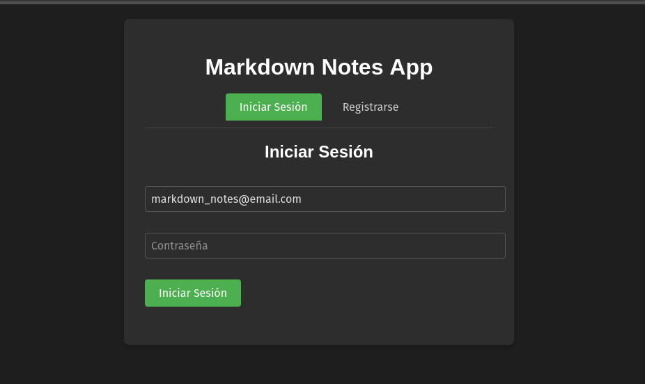
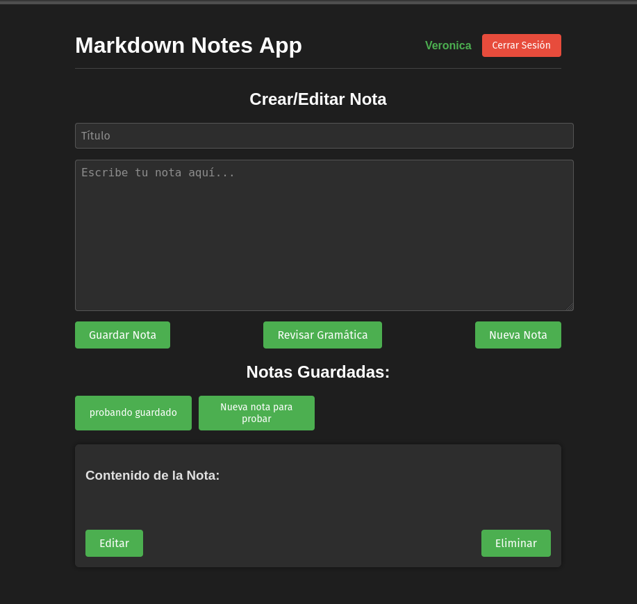

# Notes Application

## Table of Contents

* [Application Description 📝](#application-description)
* [Architecture 🏗️](#architecture)
* [Key Features ✨](#key-features)
* [Application Preview 🖼️](#application-preview)
* [How to Download and Run the Application ⬇️](#how-to-download-and-run-the-application)
* [API Testing with Postman 🔧](#api-testing-with-postman)
* [Run Tests ✅](#run-tests)
* [Future Improvements 🚀](#future-improvements)


## Application Description

This is a Markdown notes application that allows users to:

- Create an account and log in securely
- Save, edit, retrieve, and delete personal notes
- Check grammar in your notes content
- Ensure privacy by only accessing your own notes

The application is structured using a hexagonal architecture for better separation of concerns. It comes with Docker to facilitate local installation and execution on any machine. Docker will also start a local MongoDB database where users and notes will be stored. All dependencies are managed through **Poetry**.

## Architecture

The application follows a **Hexagonal Architecture** (also known as Ports and Adapters) with the following components:

- **Domain Layer**: Contains the core business logic with entities, value objects, and repository interfaces.
- **Application Layer**: Implements use cases through services that orchestrate the domain objects.
- **Infrastructure Layer**: Provides concrete implementations for external concerns like databases and APIs.

## Key Features

- **User Authentication**: Secure user registration and login with proper authorization checks
- **Note Management**: Create, read, update, and delete notes with Markdown support
- **Grammar Checking**: Built-in grammar verification for note content
- **Security**: Authorization system that ensures users can only access their own notes
- **Dependency Injection**: Utilizes the `inject` library to manage dependencies, making the code more testable and maintainable
- **Value Objects**: Implements domain concepts as immutable objects with built-in validation
- **Repository Pattern**: Abstracts data access behind interfaces, allowing for different implementations
- **MongoDB Integration**: Uses Motor for asynchronous MongoDB access with proper UUID handling

## Application Preview

### Login Screen


### Main Notes Interface


## How to Download and Run the Application

1. **Clone the repository:**

   ```bash
   git clone https://github.com/veromel/Markdown-notes-python-app.git
   cd your-repository
   ```

2. **Start Docker from the terminal:**

   Make sure Docker is installed and running:

   ```bash
   docker-compose up
   ```

3. **Open the interface:**

   - Open the `index.html` file in a **Firefox** browser.
   - Note: Currently, it does not work properly in Chrome due to certain compatibility issues.

4. **Create an account:**
   
   - Register with your email and password on the signup page
   - Log in to access your personal notes dashboard

## API Testing with Postman

To test the API, you can use the Postman collection included in the project:

- [Download Postman Collection](Markdown_notes_app.postman_collection.json)

You can import this collection into Postman to easily interact with the API endpoints defined, including both user management and note operations.

### Importing into Postman

1. Open Postman.
2. Click on `Import` in the top left corner.
3. Select `Upload Files`.
4. Choose `Markdown_notes_app.postman_collection.json` from the project root directory.

Once imported, you'll be able to test various functionalities:
- User registration and authentication
- Creating, retrieving, updating, and deleting notes
- Grammar checking

## Run Tests

The application includes both unit tests and integration tests to ensure code quality and functionality.

### Run Unit Tests

Run the unit tests to verify individual components:

```bash
pytest tests/unit -v
```

### Run Integration Tests

Run integration tests to verify the application works correctly with MongoDB:

```bash
pytest tests/integration -v
```

### Run All Tests

Run all tests with coverage report:

```bash
pytest -v
```

## Future Improvements

- Implement note sharing between users
- Add tagging and categorization for notes
- Implement markdown preview functionality
- Add support for file attachments

