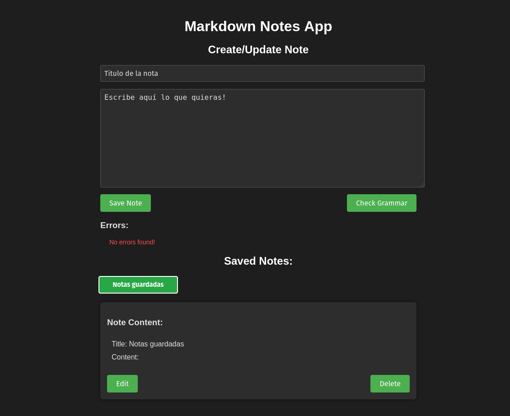

# Notes Application

## Table of Contents

* [Application Description 📝](#application-description)
* [Application Preview 🖼️](#application-preview)
* [How to Download and Run the Application ⬇️](#how-to-download-and-run-the-application)
* [API Testing with Postman 🔧](#api-testing-with-postman)
* [Run Unit Tests ✅](#run-unit-tests)
* [Future Improvements 🚀](#future-improvements)


## Application Description

This is a simple notes application that allows you to:

- Save, edit, retrieve, and delete notes.
- Check the grammar of the content you are writing.

The application is structured with a hexagonal architecture for practice purposes. It also comes with Docker to facilitate local installation and execution on any machine. Docker will also start a local MongoDB database where the notes you create will be stored. All dependencies are managed through **Poetry**.

## Application Preview



## How to Download and Run the Application

1. **Clone the repository:**

   ```bash
   git clone https://github.com/veromel/Markdown-notes-python-app.git
   cd your-repository
   ```

2. **Start Docker from the terminal:**

   Make sure Docker is installed and running:

   ```bash
   docker-compose up
   ```

3. **Open the interface:**

   - Open the `index.html` file in a **Firefox** browser.
   - Note: Currently, it does not work properly in Chrome due to certain compatibility issues.

## API Testing with Postman

To test the API, you can use the Postman collection included in the project:

- [Download Postman Collection](Markdown_notes_app.postman_collection.json)

You can import this collection into Postman to easily interact with the API endpoints defined.

### Importing into Postman

1. Open Postman.
2. Click on `Import` in the top left corner.
3. Select `Upload Files`.
4. Choose `Markdown_notes_app.postman_collection.json` from the project root directory.

Once imported, you'll be able to test various functionalities such as creating, retrieving, updating, and deleting notes using the endpoints provided.

## Run Unit Tests

Run the unit tests using **pytest**:

```bash
  pytest -v
```

This will execute all tests and provide a summary of the results.

## Future Improvements

- Additionally, a **users module** will be added later to enable user login so that each user can have their own notes.

